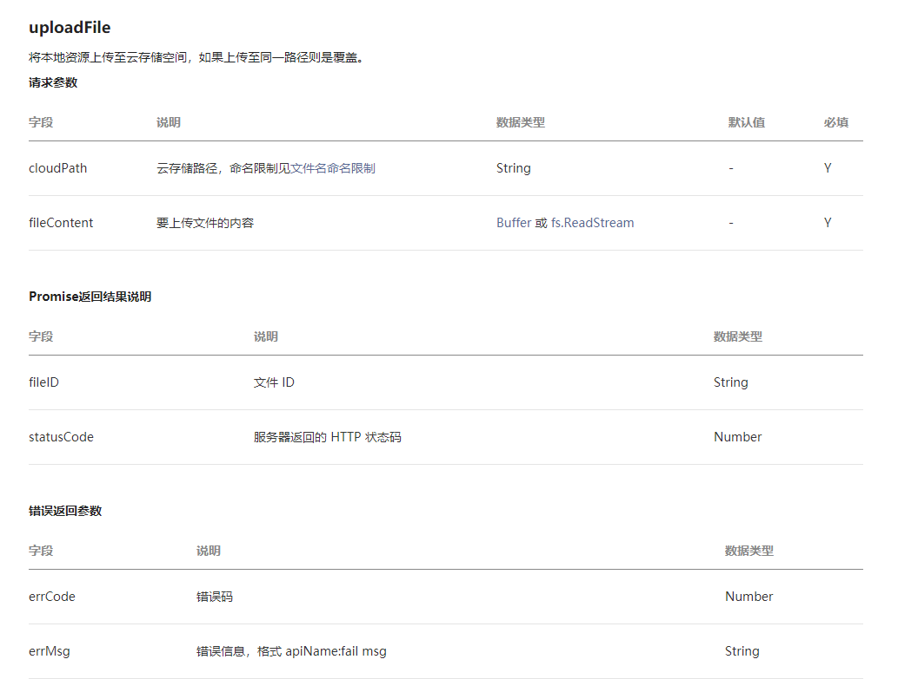

[TOC]

# Flask与微信小程序之文件上传与显示

## 背景

因为写的项目在发布任务的时候需要附加一张图片，所以后台需要一个图片上传的api接口，然后用原来的flask进行传送文件并不是十分地方便，因此此处使用的是flask_uploads模块

## flask_uploads应用

[官方文档](<https://pythonhosted.org/Flask-Uploads/>)
### flask_uploads的使用步骤
#### 1 安装flask-uploads模块

```
pip install flask-uploads
```

#### 2 在文件夹中导入需要用到的库

```python
from flask_uploads import UploadSet, configure_uploads, IMAGES, patch_request_class
```

#### 3 在config.py 配置文件上传的路径，以及限制上传文件的类型

```python
UPLOADED_PHOTOS_DEST = './images/'  # 相对路径下的文件夹images
UPLOADED_PHOTO_ALLOW = IMAGES		# 限制只能够上传图片
```

#### 4 实例化UploadSet对象并将app的config配置注册到UploadSet对象上

```python
uploaded_photos = UploadSet('photos')
configure_uploads(app, uploaded_photos)
```

#### 5 创建上传文件的路由

```
路由说明：
url = "/temp/upload/<openid>"
methods = ['POST']
return_msg:
{
  'error' : 0/1
  'data': 
  {
    'msg': '没有图片上传/创建成功/图片上传失败'
    'url':  image_path
  }
}
```

```python
@app.route("/temp/upload/<openid>", methods=['POST']) 
def upload_temp_image(openid):
	openid = int(openid)
	filenames = os.listdir("./images")
	for filename in filenames:
		temp = filename.split('--')
		if len(temp) < 2:
			continue
		if temp[1] == str(openid) + '.png':
			os.remove('./images/' + filename)
			print('删除重复文件')
			break
	photo = request.files['photo']
	if photo.filename == '':
		print('No selected file')
		return str({'error': 1, "data": {'msg': '没有图片上传', 'url':""}})
	else:
		try:
			photo.filename = generate_verification_code() + '--' + str(openid) + '.png'
			uploaded_photos.save(photo)
			image_path = uploaded_photos.url(photo.filename)
			return str({'error': 0, "data": {'msg': '创建成功', 'url': image_path}})
		except Exception as e:
			print('upload file exception: %s' % e)
			return str({'error': 1, "data": {'msg': '图片上传失败', 'url':""}})
```

#### 6 创建一个显示图片的路由

```python
@app.route("/_uploads/photos/<image_path>")
def show_image(image_path):
	'''
	利用图片url用于显示
	'''
	with open(UPLOADED_PHOTOS_DEST + image_path, 'rb') as f:
		image = f.read()
	pic_url = Response(image, mimetype="image/jpeg")
	return pic_url
```

### flask_uploads使用过程中需要注意的事项

#### 1. 上传文件可选择的类型有：

```python
IMAGES = tuple('jpg jpe jpeg png gif svg bmp'.split())
DOCUMENTS = tuple('rtf odf ods gnumeric abw doc docx xls xlsx'.split())
AUDIO = tuple('wav mp3 aac ogg oga flac'.split())
TEXT = ('txt',)
DEFAULT = TEXT + DOCUMENTS + IMAGES + DATA
```

#### 2. config中的变量与uploadset的对应

```
源码部分：
def config_for_set(uset, app, default=None):
    config = app.config
    prefix = 'UPLOADED_%s_' % uset.name.upper()
    using_defaults = False
    if defaults is None:
        defaults = dict(dest=None, url=None)

    allow_extns = tuple(config.get(prefix + 'ALLOW', ()))
    deny_extns = tuple(config.get(prefix + 'DENY', ()))
    destination = config.get(prefix + 'DEST')
    base_url = config.get(prefix + 'URL')
```

#### 3. 限制上传文件的大小

```
patch_request_class(app, 32 * 1024 * 1024)
```

#### 4. 防止爬取图片

- 上传的图片添加随机6位数字前缀，然后将对应的url存储与数据库之中

```python
photo.filename = generate_verification_code() + '--' + str(openid) + '.png'
```

## 微信小程序上传文件

### Choose Image

#### [官方文档](<https://developers.weixin.qq.com/miniprogram/dev/api/media/image/wx.chooseImage.html>)

#### 主要的参数如下

| 属性       | 说明                                                         |
| ---------- | ------------------------------------------------------------ |
| count      | 最多可以选择的图片张数                                       |
| sizeType   | 所选择的图片的尺寸    ['original', 'compressed']             |
| sourceType | 选择图片的来源 ['album', 'camera']                           |
| success    | 上传成功的回调函数  tempFilePaths：图片的本地临时文件路径列表 |

### UploadFile的使用

#### 官方文档对该函数的参数



#### 上面后端代码对应的前端代码

```javascript
async selectImg() {
    var that = this
    wx.chooseImage({
        count: 1,
        sizeType: ['original', 'compressed'],
        sourceType: ['album', 'camera'],
        success: function(res) {
            var tempFilePaths = res.tempFilePaths
            // that.setData({
            //   image_src: tempFilePaths
            // })
            that.tempFilePath = tempFilePaths
            wx.uploadFile({
                url: BASIC_REQUEST_URL + '/temp/upload/' + that.openid,
                filePath: that.tempFilePath[0],
                name: 'photo',
                success (res) {
                    console.log(res)
                    var datas = JSON.parse(res.data.replace(/'/g, '"'))
                    console.log(datas)
                    that.setData({
                        image_src: datas.data.url
                    })
                    that.image_src = datas.data.url
                }
            })
        }
    })
}
```

### 前端同时传递file与data的方法如下：

```javascript
wx.uploadFile({
    url: BASIC_REQUEST_URL + '/tasks/create/',
    filePath: that.tempFilePath[0],
    name: 'photo',
    formData: {
        'openid': that.openid,
        'limit_time': that.endDate + ' ' + that.endTime + ':00',
        'limit_num': parseInt(that.limit_num),
        'title': that.taskTitle,
        'content': that.content,
        'tag': that.TaskTypes[that.TaskTypeIndex],
        'reward': parseInt(that.reward),
        'problem_content': problemContent
    },
    success (res) {
        console.log(res)
        var datas = JSON.parse(res.data.replace(/'/g, '"'))
        that.onLoad()
    }
})
```

**其余详情可以参见[闲余翻身](<https://github.com/sysu-team1>)**