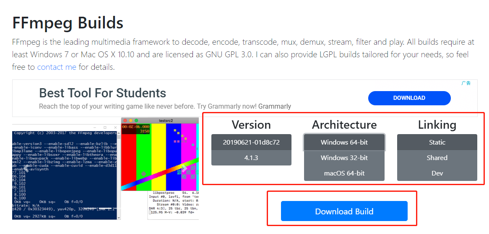
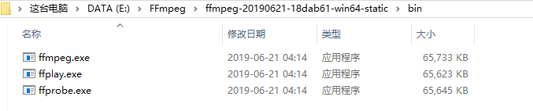
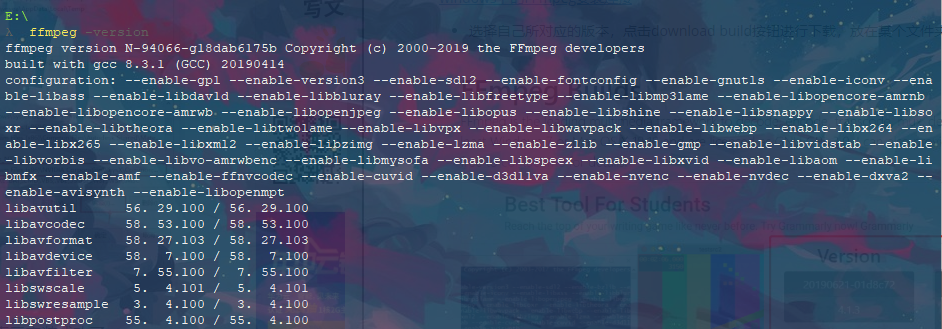

[TOC]

# Windows 下 FFmpeg的使用

## 前言

- 因为系统分析的项目网页最后要求视频展示，不过因为github不能够显示视频，另外因为时间比较匆忙，上传视频还需要审核所以不是很现实，因此最快的方法是将拍摄的视频转化为gif格式然后显示出来

- 网上在线的mp4转化为gif格式的一般都要求视频的时间不能够超过30秒，所以也没有办法，
- 于是在网上经过查找之后知道了可以安装这个歌工具进行视频转gif的操作，不过发现了这个东西还有还能有很多的用途。

## FFmpeg的基本编转码原理

ffmpeg工具主要用途为编码、解码、转码，常用ffmpeg做的为转码操作，使用ffmpeg转码主要原理为：


## FFmpeg的安装

[windows下的FFmpeg安装连接](<https://ffmpeg.zeranoe.com/builds/>)

- 选择自己所对应的版本，点击download build按钮进行下载，放在某个文件夹中



- 解压后复制下载的文件夹中bin文件夹所在的目录然后添加到系统环境变量之中



- 打开自己的终端，输入ffmpeg -version，显示如下，则表示安装成功



## ffmpeg命令行说明

```
ffmpeg -i {输入文件路径} -b:v {输出视频码率} .. {若干条件} .. {输出文件路径}
```

### 主要的参数如下

| 参数         | 意义                                                 |
| ------------ | ---------------------------------------------------- |
| -i filename  | 输入文件                                             |
| -t duration  | 设置处理时间，格式为hh:mm:ss                         |
| -ss position | 设置起始时间，格式为hh:mm:ss                         |
| -b:v bitrate | 设置视频码率 码率格式如 600k 或 600000               |
| -b:a bitrate | 设置音频码率 码率格式如 64k 或 64000，如果过小会报错 |
| -r fps       | 设置帧率                                             |
| -s wxh       | 设置帧大小，格式为Width x Height                     |
| -c:v codec   | 设置视频编码器                                       |
| -c:a codec   | 设置音频编码器                                       |
| -ar freq     | 设置音频采样率                                       |

### 使用

#### ffmpeg 代码实现视频截取

```
ffmpeg -i in_file -ss hh:mm:ss -t hh:mm:ss -codec copy out_file
```

-c :视频的音频，视频的编码方式

#### ffmpeg 代码实现视频添加水印功能

```
ffmpeg -i in_file -i in_image -filter_complex "overlay=5:5" out_file
in_file 视频源文件
in_image 要打印的图片
overlay 设置水印图片的位置
out_file 添加水印后的文件
```

#### ffmpeg代码实现视频与音频分离

```
分离视频流
ffmpeg -i in_file -vcodec copy -an out_file_video
分离音频流
ffmpeg -i in_file -acodec copy -vn out_file_audio
```

#### ffmpeg 代码实现视频截图

```
指定时间与位置截图 -ss 后面参数是秒
ffmpeg -i in_file -y -f image2 -ss 08.010 -t 0.001 -s width x height out_image
将视频前fps帧制作成GIF
ffmpeg -i in_file -vframes fps -y -f gif out_image
```

#### 利用批处理，批量转码

- 当有大量的视频需要转码时，可以使用如下命令行工具批量处理：

```
for /r %v in (*.mp4) do (ffmpeg -i %v -c:v libx264  -preset slow -crf 28 -c:a copy "ffmpeg\%~nv.mp4")
```

## 效果如下：

