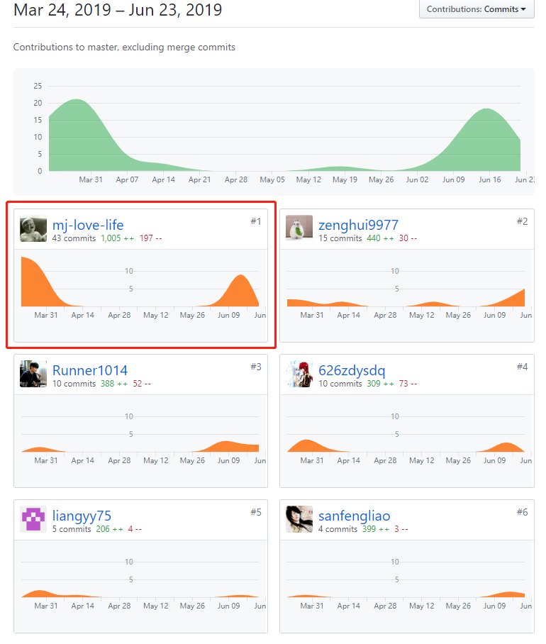
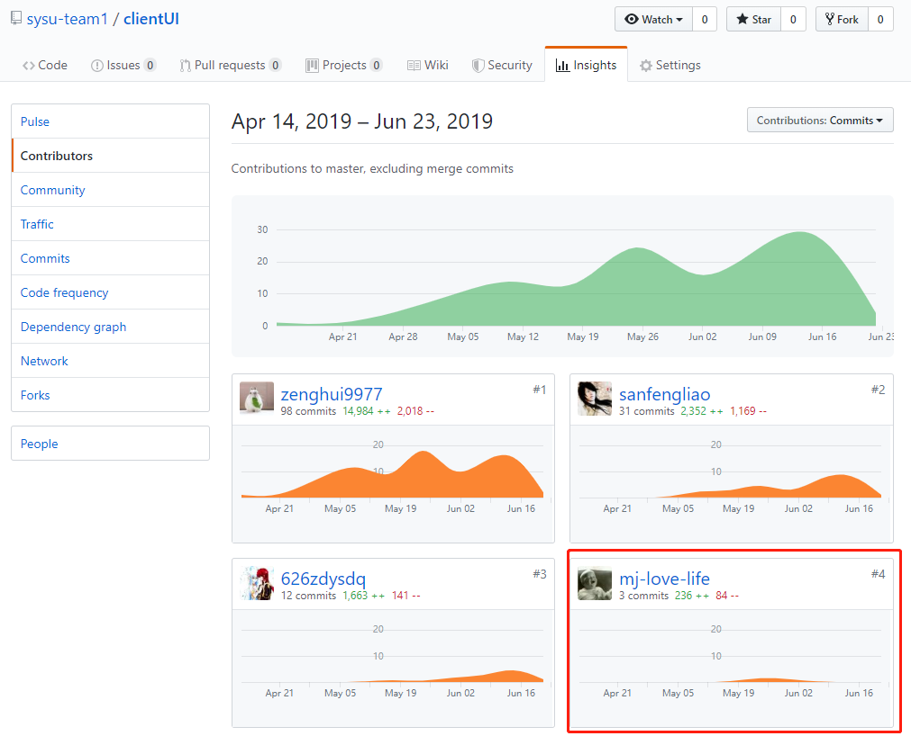
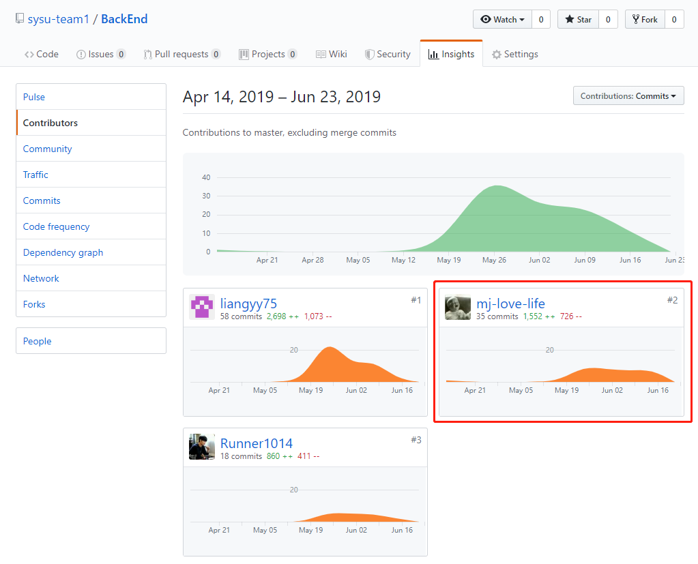

[TOC]

# 系统设计与分析课程项目个人小结

## 简短的课程学习自我总结

作为团队的python工程师以及产品经理，我的主要工作是：

- 服务器的部署：
  - MySQL与python环境配置
  - 热更新
- 后端路由的设计与编码
- 部分产品UI以及需求的设计

## 管理

- 帮助前后台沟通，保证对接时顺畅。这个主要体现在 [API 文档](https://sysu-team1.github.io/Dashboard/07-03-API)的完善上

## 分析

- 进行前期调研并初步分析app的定位以及早期需求设计
- 参与分析设计[API 文档](https://sysu-team1.github.io/Dashboard/07-03-API)

## 设计

- 设计服务器的结构以及[用例图、泳道图](https://sysu-team1.github.io/Dashboard/06-01-usecase-diagram-and-uml-activity-diagram)，以便前后端的工作更为清晰
- 在前端开发的过程中时常为前端UI设计样例以及提出需求

## 开发

- 使用flask作为框架进行开发，以及mysql作为数据库，根据API设计来设计
- 协同前端成员解决跨域问题

## PSP2.1 表格

|                                       | 任务内容                                     | 占比（%） |
| ------------------------------------- | -------------------------------------------- | --------- |
| **Planning**                          | **计划**                                     | **10**    |
| Estimate                              | 估计这个任务需要多少时间，并规划大致工作步骤 | 10        |
| **Development**                       | **开发**                                     | **75**    |
| Analysis                              | 需求分析 (包括学习新技术)                    | 10        |
| Design Spec                           | 生成设计文档                                 | 5         |
| Design Review                         | 设计复审 (和同事审核设计文档)                | 6         |
| Coding Standard                       | 代码规范 (为目前的开发制定合适的规范)        | 2         |
| Design                                | 具体设计                                     | 10        |
| Coding                                | 具体编码                                     | 27        |
| Code Review                           | 代码复审                                     | 5         |
| est                                   | 测试（自我测试，修改代码，提交修改）         | 10        |
| **Reporting**                         | **报告**                                     | **15**    |
| Test Report                           | 测试报告                                     | 2         |
| Size Measurement                      | 计算工作量                                   | 2         |
| Postmortem & Process Improvement Plan | 事后总结 ,并提出过程改进计划                 | 11        |

## 最得意/或有价值/或有苦劳的工作清单

### 最得意

部署项目，搭建好阿里云服务器并且完成邮件服务器与域名的配置，实现验证码生成以及邮件推送功能，使得项目迈出一大步

### 最有价值

发布问卷以及填写统计整个流程的API设计与实现，实现了主要功能的

### 最有劳苦

担任python工程师负责前后端的路由交接，同时担任产品经理，分析需求和设计UI，同时几乎每天都督促其他人contribute，还有服务器的热更新。

## 个人GIT总结

### Dashboard文档集合

### 闲余翻身前端

### 闲余翻身后端

## 个人博客清单

- [Windows 下 FFmpeg的使用](https://blog.csdn.net/qq_36347365/article/details/93377000)
- [Flask与微信小程序之文件上传与显示](https://blog.csdn.net/qq_36347365/article/details/93404639)
- [ORM与SQLAchemy](https://blog.csdn.net/qq_36347365/article/details/93409925)

## 特别鸣谢

- zengh 感谢小灰灰同学在前端撑起半边天以及耐心听我的UI改动并很耐心的完成了
- 626zdysdq 感谢多鱼同学编写各种文档，以及整个项目的会议和UI的贡献
- sanfengliao 感谢大佬能够在遇到bug的时候carry全场
- Runner1014 感谢大佬耐心解决前端的请求问题
- liangyy75 感谢巨佬搭建起整个数据库以及耐心指导我学会使用

